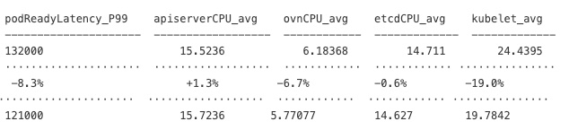

# Orion - CLI tool to find regressions
Orion stands as a powerful command-line tool/daemon designed for identifying regressions within perf-scale CPT runs, leveraging metadata provided during the process. The detection mechanism relies on [hunter](https://github.com/datastax-labs/hunter).

Below is an illustrative example of the config and metadata that Orion can handle:

```
tests :
  - name : payload-cluster-density-v2
    index: ospst-perf-scale-ci-*
    benchmarkIndex: ospst-ripsaw-kube-burner*
    metadata:
      platform: AWS
      clusterType: self-managed
      masterNodesType: m6a.xlarge
      masterNodesCount: 3
      workerNodesType: m6a.xlarge
      workerNodesCount: 6
      benchmark.keyword: cluster-density-v2
      ocpVersion: 4.17
      networkType: OVNKubernetes

    metrics : 
    - name:  podReadyLatency
      metricName: podLatencyQuantilesMeasurement
      quantileName: Ready
      metric_of_interest: P99
      not: 
        jobConfig.name: "garbage-collection"
      labels:
        - "[Jira: PerfScale]"
      direction: 0

    - name:  apiserverCPU
      metricName : containerCPU
      labels.namespace.keyword: openshift-kube-apiserver
      metric_of_interest: value
      agg:
        value: cpu
        agg_type: avg
      labels:
        - "[Jira: kube-apiserver]"
      direction: 0

    - name:  ovnCPU
      metricName : containerCPU
      labels.namespace.keyword: openshift-ovn-kubernetes
      metric_of_interest: value
      agg:
        value: cpu
        agg_type: avg
      labels:
        - "[Jira: Networking / ovn-kubernetes]"
      direction: 0

    - name:  etcdCPU
      metricName : containerCPU
      labels.namespace.keyword: openshift-etcd
      metric_of_interest: value
      agg:
        value: cpu
        agg_type: avg
      labels:
        - "[Jira: etcd]"
      direction: 0
    
    - name:  etcdDisk
      metricName : 99thEtcdDiskBackendCommitDurationSeconds
      metric_of_interest: value
      agg:
        value: duration
        agg_type: avg
      labels:
        - "[Jira: etcd]"
      direction: 0

    - name: kubelet 
      metricName : kubeletCPU 
      metric_of_interest: value 
      labels: 
        - "[Jira: Node]" 
      agg: 
        value: cpu 
        agg_type: avg
      direction: 0

```
**Note**: `direction: 1` specifies to show positive changes, `direction: 0` specifies to show both positive and negative changes while `direction: -1` shows negative changes.

## Build Orion
Building Orion is a straightforward process. Follow these commands:

**Note: Orion Compatibility**

Orion currently supports Python version `3.11.x`. Please be aware that using other Python versions might lead to dependency conflicts caused by hunter, creating a challenging situation known as "dependency hell." It's crucial to highlight that Python `3.12.x` may result in errors due to the removal of distutils, a dependency used by numpy. This information is essential to ensure a smooth experience with Orion and avoid potential compatibility issues.

Clone the current repository using git clone.

```
>> git clone <repository_url>
>> python3 -m venv venv
>> source venv/bin/activate
>> pip install -r requirements.txt
>> export ES_SERVER = <es_server_url>
>> pip install .
```
## Run Orion
Executing Orion is as seamless as its building it. With the latest enhancements, Orion introduces a versatile command-line option and a Daemon mode, empowering users to select the mode that aligns perfectly with their requirements.

### Command-line mode
Running Orion in command-line Mode is straightforward. Simply follow these instructions:
```
>> orion cmd --hunter-analyze
```
At the moment, 

Orion provides flexibility in configuring its behavior by allowing users to set the path to their config file using the ```--config``` flag. 

For enhanced troubleshooting and debugging, Orion supports the ```--debug``` flag, enabling the generation of detailed debug logs. 

Activate Orion's regression detection tool for performance-scale CPT runs effortlessly with the ```--hunter-analyze``` command. This seamlessly integrates with metadata and hunter, ensuring a robust and efficient regression detection process.

Additionally, users can specify a custom path for the output CSV file using the ```--output``` flag, providing control over the location where the generated CSV will be stored.

Orion now supports anomaly detection for your data. Use the ```--anomaly-detection``` command to start the anomaly detection process.


To be able to find significant percent differences in workload runs, use the ```--cmr``` command. This will compare the most recent run with any previous matching runs or baseline UUIDs. If more than 1 other run is found from the most recent, the values will be meaned together and then compared with the previous run. Use with *direction: 0* (set in the config) when using ```-o json``` format to see percent differences



You can now constrain your look-back period using the ```--lookback``` option. The format for look-back is ```XdYh```, where X represents the number of days and Y represents the number of hours.

To specify how many runs to look back, you can use the ```--lookback-size``` option. By default, this option is set to 10000.

**_Note_** This particular feature clashes along with the idea of having to lookback for X number of days. The precedence of both the flags are equal and the using both at the same time returns the runs until the cutoff whichever is shorter. To provide precedence context one can understand the following example:

Consider the following runs
```
1 -- 21 Aug
2 -- 22 Aug
3 -- 22 Aug
4 -- 22 Aug
5 -- 23 Aug
6 -- 23 Aug
7 -- 24 Aug
8 -- 25 Aug
9 -- 26 Aug
```
Today is 27 Aug, and 
case 1: we want to get data of previous 5 days, the `--lookback` flag gets us the runs [2,9]
case 2: we want to get data of previous 6 runs, the `--lookback-size` flag gets us the runs [4,9]
case 3: when we use both `--lookback` and `--lookback-size`
- Consider we pass `--lookback 5d --lookback-size 6` now this gets the union of both [2,9] and [4,9] which is [4,9]
- Consider we pass `--lookback 3d --lookback-size 6` now this gets the union of both [7,9] and [4,9] which is [7,9]

This is similar to how car manufacturers warranty plays out such as 5years or 60k miles whichever comes first.

**Why we do not want higher precedence for a single flag?**
- These flags are optional to use, if we give higher precedence to a single flag and use both flags, the same functionality  can be achieved by just passing the single flag(higher precedence) and ignoring the other.
- In a use case where we would like to just see latest n number of runs and restricted to a date, using both operators can achieve it. Say I want latest 15 runs from past 10 days, this way of having no precedence allows us to have it. If there are more than 15 runs it gets only 15 runs, if there are less than 15 runs it gets the last 10 days runs.

You can open the match requirement by using the ```--node-count``` option to find any matching uuid based on the metadata and not have to have the same jobConfig.jobIterations. This variable is a ```True``` or ```False```, defaulted to False. 

**_NOTE:_**  The ```cmr```, ```--hunter-analyze``` and ```--anomaly-detection``` flags are mutually exclusive. They cannot be used together because they represent different algorithms designed for distinct use cases.

#### Ack known bugs
To ack known regressions, you must provide a yaml file with the timestamp which the regression was identified at.

```
---
ack :
  - timestamp: 1733490603,
    metric: "etcdCPU_avg"
```

ack'ing regressions will ensure Orion doesn't continue to notify users of the same issues.

### Daemon mode
The core purpose of Daemon mode is to operate Orion as a self-contained server, dedicated to handling incoming requests. By sending a POST request accompanied by a test name of predefined tests, users can trigger change point detection on the provided metadata and metrics. Following the processing, the response is formatted in JSON, providing a structured output for seamless integration and analysis. To trigger daemon mode just use the following commands

```
>> orion daemon
```
**Querying a Test Request to the Daemon Service**

To interact with the Daemon Service, you can send a POST request using `curl` with specific parameters.

*Request URL*

```
POST http://127.0.0.1:8080/daemon/changepoint
```

*Parameters*

- uuid (optional): The uuid of the run you want to compare with similar runs.
- baseline (optional): The runs you want to compare with.
- version (optional): The ocpVersion you want to use for metadata defaults to `4.15`
- filter_changepoints (optional): set to `true` if you only want changepoints to show up in the response
- test_name (optional): name of the test you want to perform defaults to `small-scale-cluster-density`


Example
```
curl -L -X POST 'http://127.0.0.1:8080/daemon/changepoint?filter_changepoints=true&version=4.14&test_name=small-scale-node-density-cni'
```


Below is a sample output structure: the top level of the JSON contains the test name, while within each test, runs are organized into arrays. Each run includes succinct metadata alongside corresponding metrics for comprehensive analysis.
```
{
    "aws-small-scale-cluster-density-v2": [
        {
            "uuid": "4cb3efec-609a-4ac5-985d-4cbbcbb11625",
            "timestamp": 1704889895,
            "buildUrl": "https://tinyurl.com/2ya4ka9z",
            "metrics": {
                "ovnCPU_avg": {
                    "value": 2.8503958847,
                    "percentage_change": 0
                },
                "apiserverCPU_avg": {
                    "value": 10.2344511574,
                    "percentage_change": 0
                },
                "etcdCPU_avg": {
                    "value": 8.7663162253,
                    "percentage_change": 0
                },
                "P99": {
                    "value": 13000,
                    "percentage_change": 0
                }
            },
            "is_changepoint": false
        },
    ]
}
```

Similarly, one can use the ```/daemon/anomaly``` endpoint to get anomaly detection on the preset metadata.

**Querying List of Tests Available to the Daemon Service**

To list the tests available, you can send a GET request using `curl`. 

*Request URL*

```
GET http://127.0.0.1:8000/daemon/options
```

*Request Body*

The request body should contain the file you want to submit for processing. Ensure that the file is in the proper format (e.g., YAML).

Example
```
curl -L 'http://127.0.0.1:8000/daemon/options'
```

Below is a sample output structure: It contains the opinionated approach list of files available
```
{
    "options": [
        "small-scale-cluster-density",
        "small-scale-node-density-cni"
    ]
}
```

Orion's seamless integration with metadata and hunter ensures a robust regression detection tool for perf-scale CPT runs.


```--uuid``` : If you have a specific uuid in mind (maybe a current run), you can bypass the metadata configuration portion of the config file and use this paraemter. You will still need to specify a config file that contains a metrics section for the metrics you want to collect on the current uuid and uuids that match the metadata of the uuid configuration

```
tests :
  - name : aws-small-scale-cluster-density-v2
    index: ospst-perf-scale-ci-*
    benchmarkIndex: ospst-ripsaw-kube-burner*
    metrics : 
    - name:  etcdDisck
      metricName : 99thEtcdDiskBackendCommitDurationSeconds
      metric_of_interest: value
      agg:
        value: duration
        agg_type: avg
```

Orion provides flexibility if you know the comparison uuid you want to compare among, use the ```--baseline``` flag. This should only be used in conjunction when setting uuid. Similar to the uuid section mentioned above, you'll have to set a metrics section to specify the data points you want to collect on.

`--uuid` and `--baseline` options are available both in cmd and daemon mode

